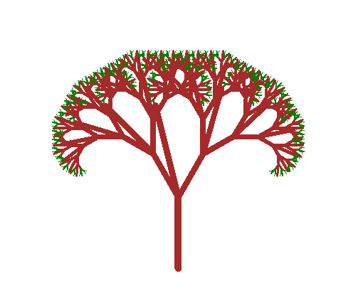
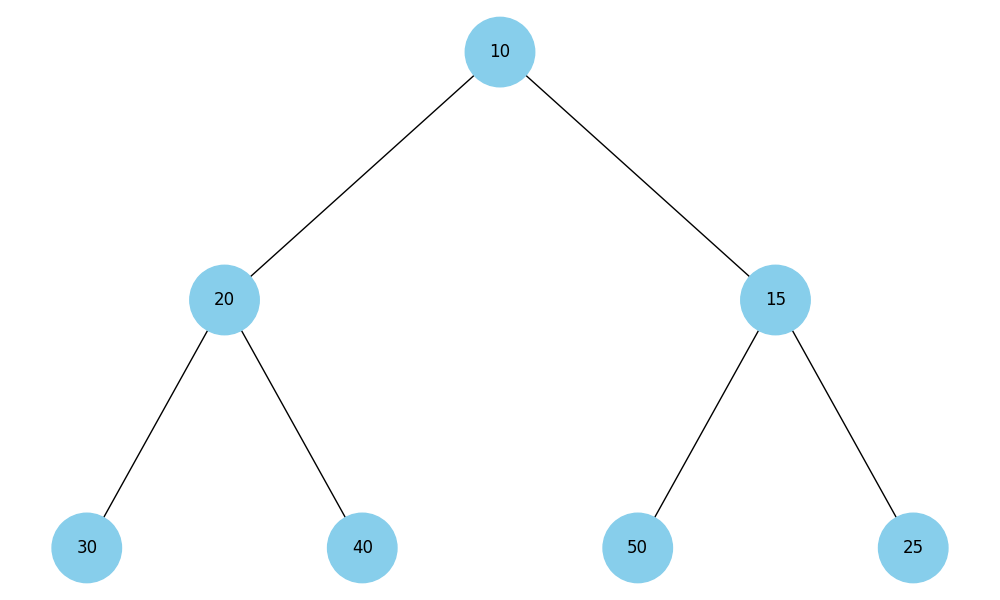
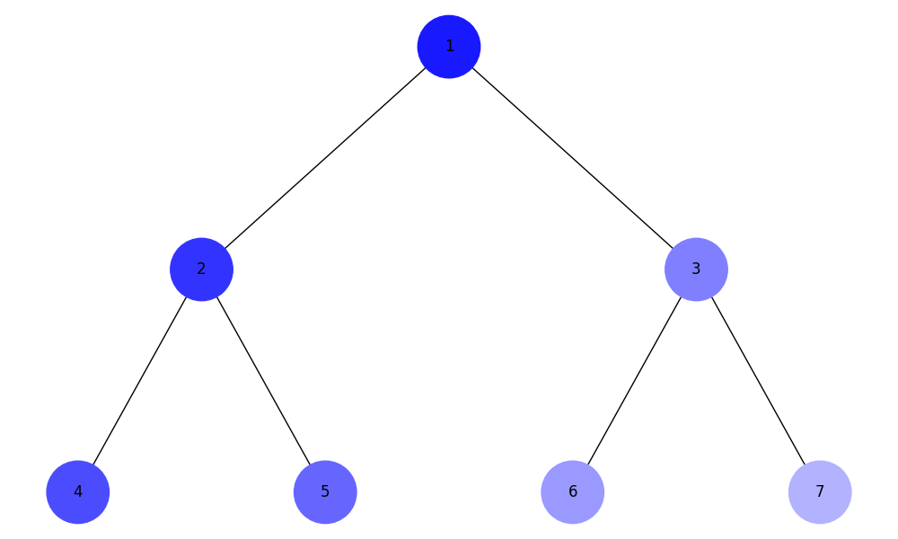
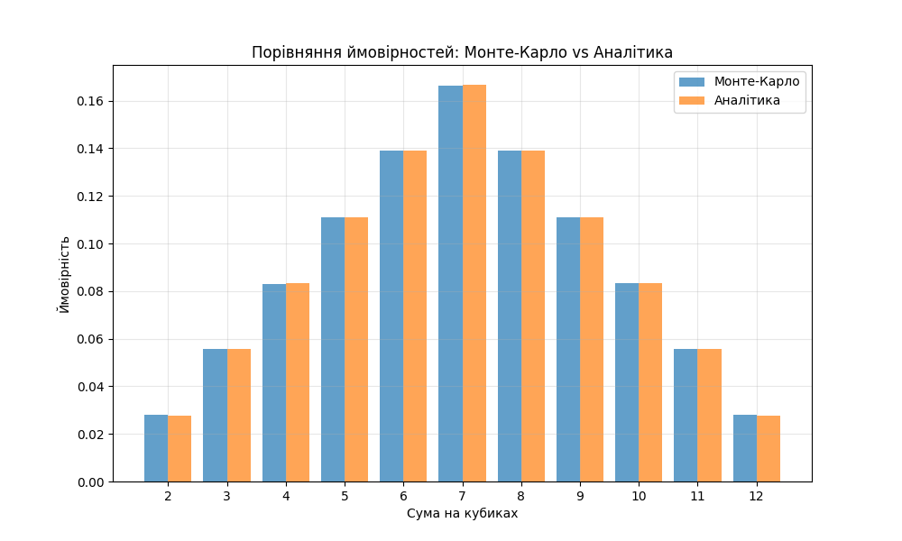

# Фінальний проект: Алгоритми та структури даних

## Завдання 1: Однозв'язний список
**Файл:** `task1_linked_list.py`

**Реалізовано:**
- Реверсування списку (змінення посилань)
- Сортування вставками для однозв'язного списку
- Злиття двох відсортованих списків

**Тестування:**
```bash
python task1_linked_list.py
```

**Результат:**
```
Original: 3 -> 1 -> 4 -> 1 -> 5
Reversed: 5 -> 1 -> 4 -> 1 -> 3
Sorted: 1 -> 1 -> 3 -> 4 -> 5
Merged: 1 -> 1 -> 2 -> 3 -> 3 -> 4 -> 5 -> 6
```

---

## Завдання 2: Фрактал "Дерево Піфагора"
**Файл:** `task2_pythagoras_tree.py`

**Реалізовано:**
- Рекурсивне малювання фрактала з модулем turtle
- Користувач вводить рівень рекурсії (1-15)

<div align="center">



</div>

**Тестування:**
```bash
python task2_pythagoras_tree.py
Введіть рівень рекурсії (1-15): 10
```

---

## Завдання 3: Алгоритм Дейкстри
**Файл:** `task3_dijkstra.py`

**Реалізовано:**
- Граф зі зваженими ребрами
- Алгоритм Дейкстри з використанням двійкової купи (heapq)
- Обчислення найкоротших шляхів та маршрутів

**Тестування:**
```bash
python task3_dijkstra.py
```

**Результат:**
```
Найкоротші відстані від А:
  до A: 0
  до B: 3
  до C: 2
  до D: 8
  до E: 10

Маршрути:
  A → B: A → C → B
  A → C: A → C
  A → D: A → C → B → D
  A → E: A → C → B → D → E
```

---

## Завдання 4: Візуалізація бінарної купи
**Файл:** `task4_heap_visualization.py`

**Реалізовано:**
- Конвертація масиву в бінарне дерево купи
- Візуалізація структури за допомогою networkx та matplotlib

<div align="center">



</div>

**Тестування:**
```bash
python task4_heap_visualization.py
```

---

## Завдання 5: Обхід дерева (DFS та BFS)
**Файл:** `task5_tree_traversal.py`

**Реалізовано:**
- DFS (пошук у глибину) з використанням стека
- BFS (пошук у ширину) з використанням черги
- Кольорування вузлів залежно від порядку обходу

<div align="center">



</div>

**Тестування:**
```bash
python task5_tree_traversal.py
```

---

## Завдання 6: Жадібні алгоритми та DP
**Файл:** `task6_algorithms.py`

**Реалізовано:**
- Жадібний алгоритм: вибір страв за співвідношенням калорій/вартість
- Динамічне програмування: оптимальний набір страв для максимізації калорій

**Тестування:**
```bash
python task6_algorithms.py
```

**Результат:**
```
Жадібний алгоритм (бюджет 120):
  Вибрано: cola, potato, pepsi, hot-dog, hamburger
  Вартість: 120, Калорійність: 1120

Динамічне програмування (бюджет 120):
  Вибрано: potato, cola, pepsi, hot-dog, hamburger
  Вартість: 120, Калорійність: 1120
```

---

## Завдання 7: Метод Монте-Карло
**Файл:** `task7_monte_carlo.py`

**Реалізовано:**
- Симуляція 1,000,000 кидків двох кубиків
- Обчислення ймовірностей кожної суми
- Порівняння з аналітичними результатами

<div align="center">



</div>

**Тестування:**
```bash
python task7_monte_carlo.py
```

**Результат:**
```
Симуляція 1000000 кидків двох кубиків...

Порівняння результатів:

Сума   Монте-Карло     Аналітика       Різниця
--------------------------------------------------
2      0.0279          0.0278          0.0001
3      0.0556          0.0556          0.0000
4      0.0831          0.0833          0.0003
5      0.1110          0.1111          0.0001
6      0.1390          0.1389          0.0001
7      0.1665          0.1667          0.0002
8      0.1391          0.1389          0.0002
9      0.1110          0.1111          0.0001
10     0.0834          0.0833          0.0001
11     0.0556          0.0556          0.0000
12     0.0279          0.0278          0.0001

Висновки:
Результати Монте-Карло близькі до аналітичних розрахунків.
Чим більша кількість симуляцій, тим точніше результати.
```

---
